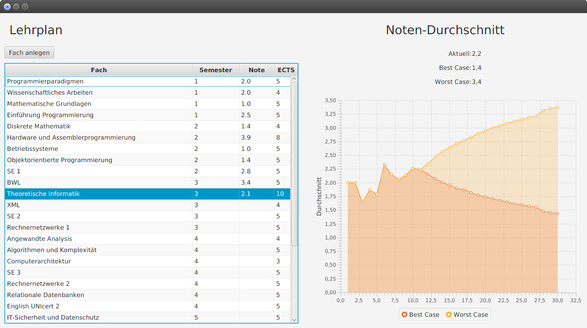

Im Rahmen des IT-Sommerfests fand ein JavaFX-Workshop der Saxonia Systems AG statt, der vor allem an 
Programmiereinsteiger und JavaFX-Interessierte gerichtet ist. Das Repository enthält den Code für die 
Beispiel-Applikation -- einem Noten-Tracking-Programm.

# Intention

In diesem Beispielprojekt soll Schritt für Schritt im Workshop die nachfolgend vorgestellte JavaFX-Applikation 
programmiert werden. Der Fokus liegt dabei nicht auf der Anwendung von professionellen Programmierpraktiken und 
Frameworks oder Bibliotheken, sondern auf dem einfachen Einstieg in die Programmierung von JavaFX UIs. Im 
Beispielprogramm wird der Einsatz von typischen UI-Elementen wie Labels, Tabellen, Buttons und z. B. auch Diagrammen 
demonstriert. 

In den verlinkten Folien (Link kommt noch) wird auf das Vorgehen, das Ziel des Workshops und einige JavaFX- Konzepte 
eingegangen. 

# Zum Noten-Tracking-Programm

Die folgende Abbildung zeigt das Noten-Tracking-Programm.

Auf der linken Seite ist eine Tabelle mit Noten für Kurse oder Fächer zu sehen. Mit dem Button darüber kann diese Liste 
durch weitere konkrete Fächer ergänzt werden. Beim Anlegen wird ein Fach mit einer versehenen Punktezahl -- den ECTS 
Points. Diese stellen eine Art Gewichtung für eine zu erreichende Endnote des Studiums dar.
Via Doppelklick auf einen Eintrag für ein Fach öffnet sich ein Dialog. Diesem kann dann die erreichte Note 
eingetragen werden.

Auf der rechten Seite aktualisiert sich mit jedem weiteren eine Statistik über die eingetragenen Noten. Sie zeigt 
eine Prognose an, welche Abschlussnote man im besten oder im schlechtesten Fall noch erreichen kann. Mit jedem 
weiteren Eintrag wird der Spielraum für die Endnote enger.

Der Student kann damit sein zu erreichendes Notenziel für den Abschluss des Studiums überprüfen und planen.